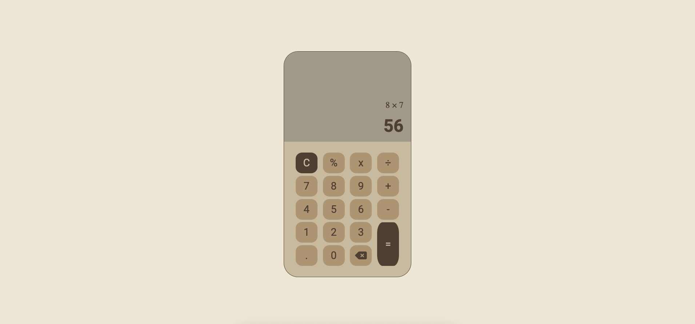

# **Basic Calculator**

A fully functional, browser-based calculator built with vanilla JavaScript, HTML, and CSS.

### **Live Demo**
[Click here for a live preview of the site.](https://aquaryasss.github.io/calculator/)

### **Features**

- All Basic Arithmetic Operations: Addition, subtraction, multiplication, division, and modulo.
- Chaining Operations: The calculator correctly evaluates a pair of numbers when a second operator is entered (e.g., 12 + 7 - 1 = 18).
- Dual Display: Includes a main display for the current input and result, and a secondary display to show the ongoing equation.
- Keyboard Support: All calculator functions can be controlled via the keyboard, including numbers, operators, Enter for equals, Backspace for delete, and Escape for clear.
- Decimal Input: Allows for floating-point numbers and prevents invalid inputs like 12.3.4.
- Delete (Backspace) Functionality: Lets users correct their input one character at a time.
- Clear Function: Fully resets the calculator's state to start a new calculation.
- Error Handling: Displays a message when the user attempts to divide by zero, preventing the application from crashing.
- Decimal Rounding: Automatically rounds answers with long decimals to 5 places to prevent display overflow.

### **Technologies Used**
- HTML5: For the structure and layout of the calculator.
- CSS3: For styling, including the use of Flexbox for the responsive button grid.
- Vanilla JavaScript (ES6+): For all the logic, including DOM manipulation, event handling, and state management.

### **How to Run Locally**

1. Clone the repository:
```sh 
    git clone https://github.com/aquaryasss/etch-a-sketch.git
```  
2. Navigate to the project directory:
```sh 
    cd etch-a-sketch
```  
3. Open the `index.html` file in your web browser of choice.

### **Screenshots**




